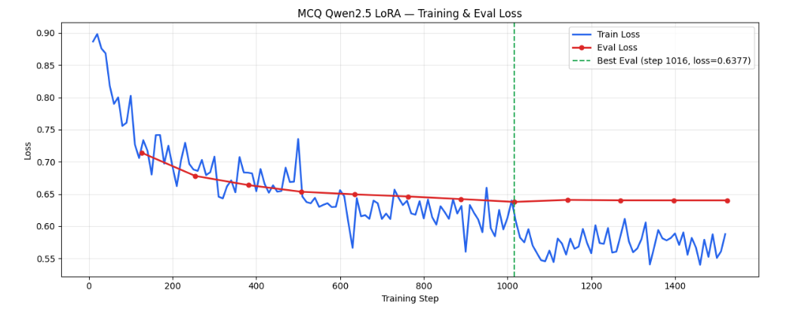
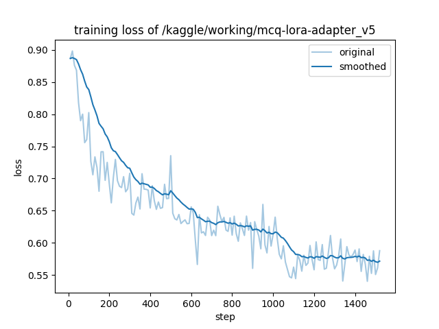
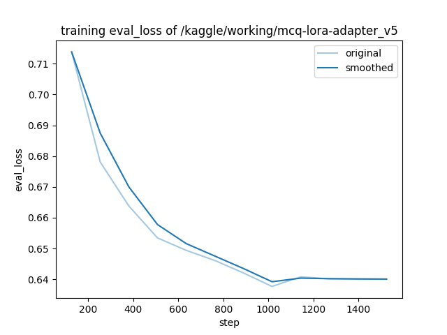

# MCQ Fine-Tuning — Notebook v5

**Model:** Qwen2.5-1.5B-Instruct  
**Method:** LoRA (via LLaMA-Factory) — Supervised Fine-Tuning on MCQ generation  
**Platform:** Kaggle (NVIDIA Tesla T4 × 2)

---

## Dataset

| Split | Size | Ratio |
|-------|------|-------|
| Train | 4,060 | 90% |
| Validation | 449 | 10% |
| **Total** | **4,509** | — |

- Stratified by **Bloom's Taxonomy level** to ensure balanced coverage across all cognitive levels
- Random seed: `42`

---

## Hyperparameters

### LoRA Configuration

| Parameter | Value |
|-----------|-------|
| `lora_rank` | 24 |
| `lora_alpha` | 24 |
| `lora_dropout` | 0.05 |
| `lora_target` | all |
| `finetuning_type` | lora |

### Training Configuration

| Parameter | Value |
|-----------|-------|
| `learning_rate` | 4.0e-5 |
| `num_train_epochs` | 3 |
| `per_device_train_batch_size` | 1 |
| `gradient_accumulation_steps` | 4 |
| `lr_scheduler_type` | cosine |
| `warmup_ratio` | 0.10 |
| `weight_decay` | 0.02 |
| `neftune_noise_alpha` | 8 |
| `bf16` | true |
| `flash_attn` | sdpa |
| `cutoff_len` | auto (P95 rounded to next 512, max 4096) |

---

## Training Results

**Best checkpoint:** Step 1016 — Eval Loss = **0.6377**

### Training & Evaluation Loss

The training loss (blue) steadily decreases from ~0.89 to ~0.57 over 1,500 steps. The evaluation loss (red) tracks well and bottoms out at **0.6377** at step 1016, after which it plateaus — indicating the best checkpoint was correctly saved before any overfitting.

### Training Loss (smoothed)

### Evaluation Loss (smoothed)

---

## Evaluation Results (CMQS — Composite MCQ Quality Score)

Scored on 6 quality dimensions using a teacher model (GPT-4 class) as the reference.

| Dimension | Teacher | Pre-FT | Post-FT | FT Gain | Post QPS |
|-----------|---------|--------|---------|---------|----------|
| D1 — Factual Grounding | 4.583 | 3.533 | 4.023 | +0.490 | 87.8% |
| D2 — Question Clarity | 4.969 | 4.854 | 4.895 | +0.041 | 98.5% |
| D3 — Correct Answer Validity | 4.885 | 3.909 | 4.331 | +0.422 | 88.7% |
| D4 — Distractor Plausibility | 3.953 | 3.691 | 3.889 | +0.199 | 98.4% |
| D5 — Bloom Alignment | 4.724 | 4.042 | 4.581 | +0.539 | 97.0% |
| D6 — Topic & LO Alignment | 4.948 | 4.594 | 4.878 | +0.284 | 98.6% |
| **CMQS (Composite)** | **4.614** | **3.954** | **4.314** | **+0.360** | **93.5%** ★ |

### Quality Preservation Score (QPS)

> QPS = Model CMQS / Teacher CMQS × 100

| Stage | CMQS | QPS |
|-------|------|-----|
| Teacher | 4.614 | 100% |
| Pre-FT (base model) | 3.954 | 85.7% |
| **Post-FT (v5)** | **4.314** | **93.5%** |

**Interpretation: EXCELLENT — Student matches teacher quality closely.**

### Bloom-Level Breakdown (Post-FT QPS)

| Bloom Level | Teacher | Pre-FT | Post-FT | Post QPS |
|-------------|---------|--------|---------|----------|
| Remember | 4.071 | 4.200 | 3.783 | 92.9% |
| Understand | 4.719 | 4.257 | 4.461 | 94.5% |
| Apply | 4.682 | 4.151 | 4.415 | 94.3% |
| Analyze | 4.684 | 3.679 | 4.247 | 90.7% |
| Evaluate | 4.467 | 3.711 | 4.278 | 95.8% |
| Create | 4.323 | 3.517 | 3.950 | 91.4% |

---

## Output Files

| File | Description |
|------|-------------|
| `mcq-lora-adapter_v5/` | LoRA adapter weights |
| `mcq-qwen-merged_v5/` | Merged model (base + LoRA) |
| `V1_radar_all_stages.png` | Spider chart: 6 dims × 3 stages |
| `V2_grouped_bar_dimensions.png` | Grouped bars per dimension |
| `V3_bloom_level_lines.png` | CMQS by Bloom level |
| `V4_quality_distribution.png` | Quality label stacked bar |
| `V5_gap_heatmap.png` | Gap heatmap: Teacher vs Student |
| `V6_cmqs_bar.png` | Composite CMQS comparison |

---

## Changes from v4

- `learning_rate` reduced: 6.0e-5 → **4.0e-5**
- `neftune_noise_alpha` reduced: 12 → **8**
- `warmup_ratio` increased: 0.05 → **0.10**
- `weight_decay` increased: 0.01 → **0.02**
- `num_train_epochs` increased: 2 → **3**
